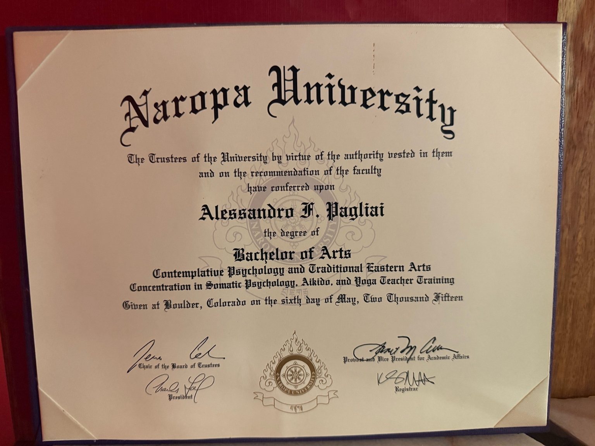
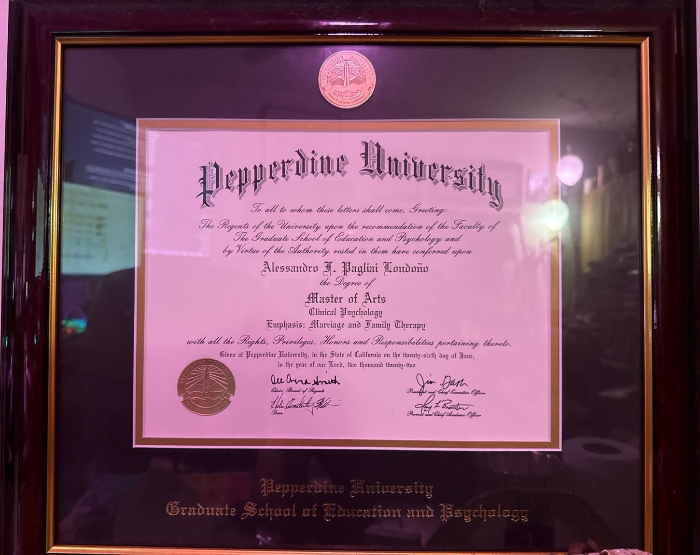

# Academic Verification Artifacts

This page catalogs verified academic achievements supporting the case study profile.

---

## Naropa University — Bachelor of Arts (2015)

*Bachelor of Arts in Contemplative Psychology and Traditional Eastern Arts*  
**Concentrations**: Somatic Psychology, Aikido, Yoga Teacher Training.  
*Conferred May 6, 2015 — Naropa University, Boulder, Colorado.*

- [View Transcript (PDF)](Naropa_BA_2015_Transcript.pdf)

---

## Pepperdine University — Master of Arts (2022)

*Master of Arts in Clinical Psychology (Emphasis in Marriage and Family Therapy)*  
*Conferred June 26, 2022 — Pepperdine University, Graduate School of Education and Psychology.*

- [View Transcript (PDF)](Pepperdine_MA_2022_Transcript_Print-1.pdf)

---

## Planned Additions
- Genealogical project export (20,500 individuals)  
- Sculpture portfolio photos  
- Training regimen logs  
